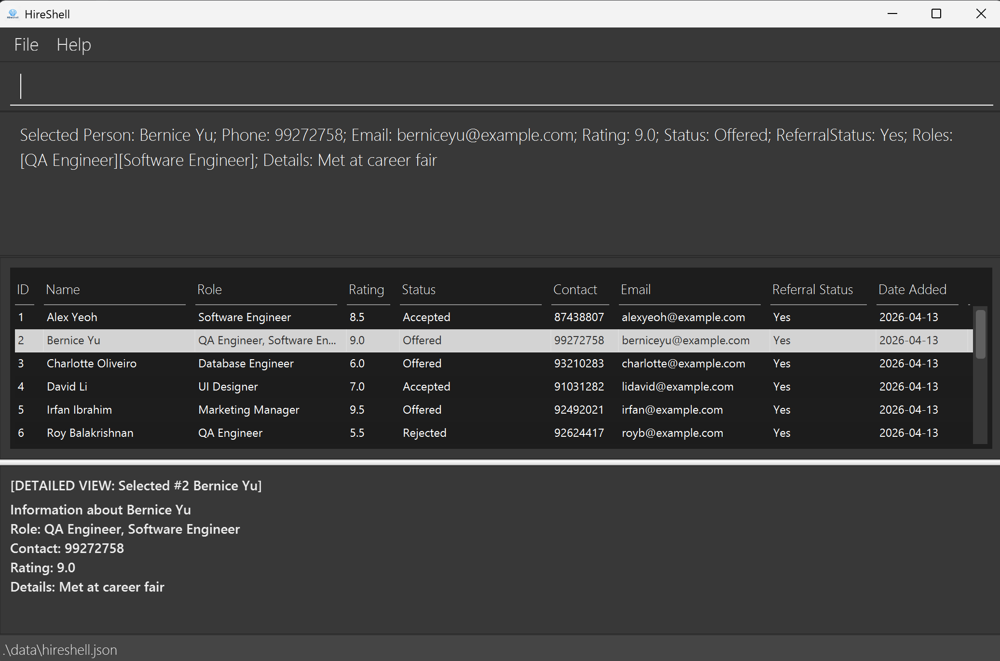

# HireShell

## Overview
HireShell is a desktop application for managing your contact details. While it has a GUI, most of the user interactions happen using a CLI (Command Line Interface).

This application provides a comprehensive list of potential job candidates. It provides the ability to quickly change details (add, delete) of contacts, including streamlined batch operations. It also categorises contacts, with the ability to quickly search, sort, and retrieve contacts. It is optimised for fast keyboard navigation.

## Technology

HireShell is built using:

- **Java**
- **JavaFX**
- **Object-Oriented Programming principles**

## Acknowledgements
This project is a **part of the se-education.org** initiative. If you would like to contribute code to this project, see [se-education.org](https://se-education.org/#contributing-to-se-edu) for more info.
